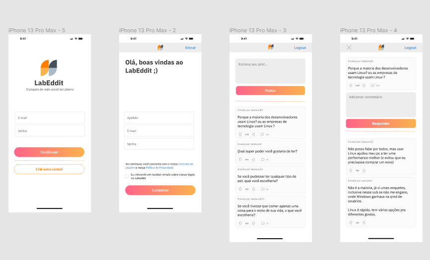

# labeddit-fullstack-frontend

Projeto fullstack para a criação de um aplicativo mobile first inspirado no Reddit.

🔴 Acesse [aqui]() o link do deploy.

## Layout

O layout foi desenvolvido a partir do template do Figma conforme mostra a figura abaixo.

## Conteúdos abordados

- JSX
- Componentes
- Styled-components
- Props
- Estado
- Fluxo de dados no React
- Local Storage
- React Router
- React Context
- Integração com APIs
- Axios
- Chakra UI

🔴 Acesse [aqui](https://github.com/alinekabbas/labeddit-fullstack-backend) o link do repositório do LabEddit Backend

## 📧 Meu Contato

