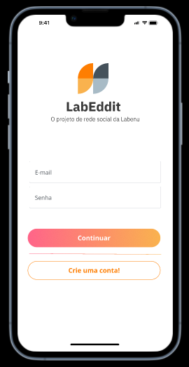

# labeddit-fullstack-frontend
Projeto fullstack para a criação de um aplicativo mobile first inspirado no Reddit.

## Layout

## Conteúdos abordados

- JSX
- Componentes
- Styled-components
- Props
- Estado
- Fluxo de dados no React
- Local Storage
- React Router
- React Context
- Integração com APIs
- Axios
- Chakra UI

## 📧 Meu Contato

